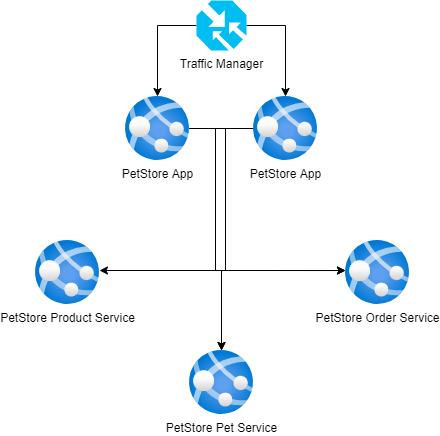

# Module 3: App Service
## Self-study materials
Please, study the following materials:
### Video:

- [Azure Administration: Implement and Manage Application Services](https://www.linkedin.com/learning/azure-administration-implement-and-manage-application-services) (~2 hr 8 min)

### Recommended:
- [Deploy a website to Azure with Azure App Service](https://docs.microsoft.com/en-us/learn/paths/deploy-a-website-with-azure-app-service/)  (~4 hr 3 min)
- [Overview of PetStore](https://github.com/chtrembl/azure-cloud/tree/main/petstore)  (~1 hr 46 min) (***CHANGE:*** eShopOnWeb -> PetStore )

*When you finish, please change the assignment status from "Planned" to "Done"*

> ## Useful tips
> As the final task is a compilation of the modules tasks and one of the completion criteria is to provide a GIT repository, would be helpful to clone the basic project to your own code repository before the current home task and commit all changes there.
In order to avoid unpredictable money spending, please, use a minimal tier for the resources as possible.

## Home task
Please, complete the following task:

- PetStore is a web application that contains:
  * Web: *petstoreapp*
  * Set of Public APIs: *petstorepetservice*, *petstoreproductservice*, *petstoreorderservice*
- These services need to be deployed to respective Azure App Services using Docker deployment. (***CHANGE:*** Docker instead of Code Deployment)
- App Service configuration needs to be updated to point Web Site to Public API URLs.
- Public API Services should be configured to auto-scale based on CPU load increase.
- Web project deployment should be available using deployment slots.

[PetStore source code](https://git.epam.com/anton_lytunenko/cloudx-java-azure-dev/-/tree/main).

### Definition of done:

- 2 Web in different regions, and Public API Services 1 for each service are deployed as Azure App Service
- Web application works and able to sign in using Azure App service URL
- Public API is configured for auto-scaling and tested (e.g [k6](https://k6.io/) tool) to generate the load that scaling works
- Web App Service should be using deployment slots (one Web App Service with deployment slots is enough)
- Traffic Manager is configured to point to 2 Web App Services and UI should be able to log in through traffic manager URL

## Clean up:
Resources left running can cost you money. You can delete resources individually or delete the resource group to delete the entire set of resources.
### Definition of done:
- Resources are deleted

*When you are ready with the task attach the screenshot to the "Result" field and change the status for "Done".*